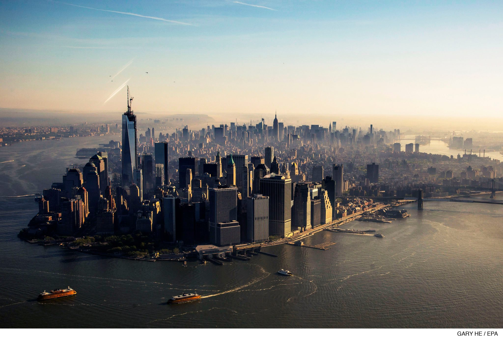
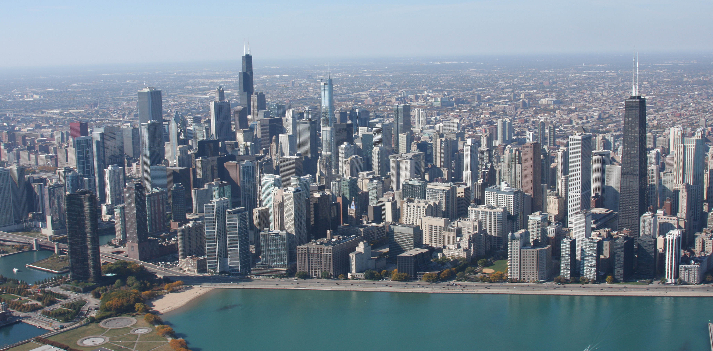
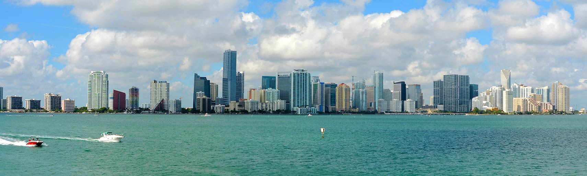

# American Skylines

In-Class Assignment 5, Casey Brentnall

## Introduction

The world's first skyscraper was built in Chicago in 1885. Since that time, the United States has been home and still is home to some of the world's tallest skyscrapers. New York City, specifically the borough of Manhattan, notably has the tallest skyline in the country. Eleven American buildings have held the title of tallest building in the world (9 in New York City).New York City and Chicago have always been the centers of American skyscraper building. The 10-story Home Insurance Building, built in Chicago in 1885, is regarded as the world's first skyscraper; the building was constructed using a novel steel-loadbearing frame which became a standard of the industry worldwide.

As of 2018, One World Trade Center in New York City is considered to be the tallest skyscraper in the United States. Its spire brings the structure to a symbolic height of 1,776 feet (541 m), connoting the year The Declaration of Independence was signed, though the tip of the structure actually is measured at 1,792 ft (546 m). However, using the more common criterion for the height of a building (the roof, not antenna) the observation deck elevation and highest occupied floor of the One World Trade Center are surpassed by Chicago's Willis Tower (formerly and still commonly known as the Sears Tower) and 432 Park Ave. 

As of 2017, the United States has 18 cities with at least 15 buildings over 400 feet.

| Rank | City              | >1000 ft | >800 ft | >600 ft | >400 ft | Total |
| ---- | ----------------- | -------- | ------- | ------- | ------- | ----- |
| 1    | New York City     | 8        | 10      | 59      | 213     | 444   |
| 2    | Chicago           | 5        | 6       | 25      | 92      | 200   |
| 3    | Miami             | 0        | 1       | 11      | 35      | 78    |
| 4    | San Francisco     | 1        | 3       | 4       | 31      | 53    |
| 5    | Houston           | 1        | 0       | 8       | 21      | 52    |
| 6    | Seattle           | 0        | 0       | 7       | 19      | 43    |
| 6    | Las Vegas         | 0        | 1       | 8       | 24      | 43    |
| 8    | Atlanta           | 1        | 2       | 6       | 23      | 40    |
| 9    | Los Angeles       | 2        | 1       | 5       | 13      | 36    |
| 10   | Philadelphia      | 1        | 1       | 1       | 18      | 31    |
| 11   | Boston            | 0        | 0       | 4       | 13      | 30    |
| 12   | Dallas            | 0        | 1       | 6       | 9       | 28    |
| 13   | Jersey City       | 0        | 0       | 0       | 13      | 22    |
| 14   | Minneapolis       | 0        | 0       | 1       | 11      | 19    |
| 15   | Sunny Isles Beach | 0        | 0       | 2       | 9       | 18    |
| 16   | Denver            | 0        | 0       | 3       | 9       | 17    |
| 17   | Pittsburgh        | 0        | 1       | 3       | 6       | 16    |
| 18   | Charlotte         | 0        | 1       | 1       | 9       | 15    |

## New York City

### History

The history of skyscrapers in New York City began with the completion of the World Building in 1890; the structure rose to 348 feet (106 m). Though not the city's first high-rise, it was the first building to surpass the 284-foot (87 m) spire of Trinity Church. The World Building, which stood as the tallest in the city until 1899, was demolished in 1955 to allow for the construction of an expanded entrance to the Brooklyn Bridge.

New York has played a prominent role in the development of the skyscraper; since 1890, eleven structures in the city having held the title of world's tallest building. New York City went through a very early high-rise construction boom that lasted from the early 1910s through the early 1930s, during which 16 of the city's 82 tallest buildings were built—including the Woolworth Building, the Bank of Manhattan Trust Building, the Chrysler Building and the Empire State Building, each of which was the tallest in the world at the time of its completion, the latter remaining so for forty years.

A second skyscraper boom began in the early 1960s. Since then, the city has seen the completion of nearly 70 structures rising at least 600 feet (183 m) high, including the twin towers of the World Trade Center. One World Trade Center, also known as the North Tower, was the tallest building in the world from 1972 until 1973 and the tallest building in New York City until 2001. The North Tower, as well as the other six buildings in the World Trade Center complex, were destroyed in the September 11 attacks of 2001.One World Trade Center began construction in 2006 as the lead building of the new World Trade Center complex; upon its topping out in May 2013, the 1,776-foot (541 m) skyscraper surpassed the Willis Tower to become the tallest building in the United States.

### Tallest Buildings

| Rank | Name                        | Height (feet) | Floors | Year Completed | Notes                                    |
| ---- | --------------------------- | ------------- | ------ | -------------- | ---------------------------------------- |
| 1    | One World Trade Center      | 1,776         | 104    | 2014           | Tallest building in the Western Hemisphere. Roof height is the same as the original WTC. |
| 2    | 432 Park Avenue             | 1,396         | 96     | 2015           | Tallest residential building in the world. |
| 3    | Empire State Building       | 1,250         | 102    | 1931           | Tallest building in the world from 1931-1972, when surpassed by the WTC. First building to contain 100 floors. |
| 4    | Bank of America Tower       | 1,200         | 54     | 2009           | First skyscraper to receive Platinum LEED certification. |
| 5    | Three World Trade Center    | 1,079         | 80     | 2018           | Topped out in 2016.                      |
| 6    | Chrysler Building           | 1,050         | 77     | 1930           | Tallest building in the world from 1930-1931. Overtook the Eiffel Tower and became  the first building over 1,000 feet. |
| 6    | The New York Times Building | 1,050         | 52     | 2007           | First high-rise in the U.S. to have a ceramic curtain wall. |
| 8    | One57                       | 1,004         | 75     | 2014           | Tallest mixed-use building in the city.  |
| 9    | Four World Trade Center     | 978           | 74     | 2013           | Part of the World Trade Center           |
| 10   | 220 Central Park South      | 953           | 69     | 2018           | Topped Out in 2017.                      |

### Timeline of Tallest Buildings

| Name                                     | Years Tallest | Height (feet) | Floors | Notes                                    |
| ---------------------------------------- | ------------- | ------------- | ------ | ---------------------------------------- |
| Collegiate Reformed Protestant Dutch Church | 1643-1846     | Unkown        | 1      | Demolished.                              |
| Trinity Church                           | 1846-1853     | 279           | 1      |                                          |
| Latting Observatory                      | 1853-1854     | 315           | 3      | Burned down 1856.                        |
| Trinity Church                           | 1854-1890     | 279           | 1      | Retakes position following destruction of Latting Observatory. |
| World Building                           | 1890-1899     | 348           | 20     | Tied with the Manhattan Life Insurance Building from 1894-1899. Demolished 1955. |
| Manhattan Life Insurance Building        | 1894-1899     | 348           | 18     | Tied with the World Building from 1894-1899. Demolished 1963. |
| Park Row Building                        | 1899-1908     | 391           | 30     |                                          |
| Singer Building                          | 1908-1909     | 612           | 47     | Tallest building in the world when constructed. Demolished 1968. |
| Metropolitan Life Insurance Company Tower | 1909-1913     | 700           | 50     | Tallest building in the world when constructed. |
| Woolworth Building                       | 1913-1930     | 792           | 57     | Tallest building in the world when constructed. |
| Bank of Manhattan Trust Building         | 1930          | 927           | 70     | Tallest building in the world when constructed. |
| Chrysler Building                        | 1930-1931     | 1,046         | 77     | Tallest building in the world when constructed. |
| Empire State Building                    | 1931-1972     | 1,250         | 102    | Tallest building in the world when constructed. |
| 1 World Trade Center                     | 1972-2001     | 1,368         | 110    | Tallest building in the world when constructed. Surpassed by the Sears Tower in 1974. Destroyed in the September 11, 2001 attacks. |
| Empire State Building                    | 2001-2013     | 1,250         | 102    | Retakes position following destruction of 1 World Trade Center. |
| One World Trade Center                   | 2013-present  | 1,776         | 104    |                                          |

## Chicago

### History

Chicago, the third-largest city in the United States, is home to 1,315 completed high-rises, 44 of which stand taller than 600 feet (183 m). The tallest building in the city is the 110-story Willis Tower (formerly the Sears Tower), which rises 1,451 feet (442 m) in the Chicago Loop and was completed in 1974. Sears Tower was the tallest building in the world from its completion, and remained the tallest building in the United States until May 10, 2013 when it was overtaken by[One World Trade Center. The second-, third- and fourth-tallest buildings in Chicago are the Trump International Hotel & Tower, the Aon Center and the John Hancock Center, respectively. Of the ten tallest buildings in the United States, four are located in Chicago. As of February 2013, the entire city had 105 buildings at least 500 feet (152 m) tall.

Chicago is the birthplace of the skyscraper. The Home Insurance Building, completed in 1885, is regarded as the world's first skyscraper. This building used the steel-frame method, innovated in Chicago. It was originally built with 10 stories, a considerable height in the 1800s, to a height of 138 feet (42 m), making it the tallest building in the world. It was later expanded to 12 stories with a height of 180 feet (55 m). The building was demolished in 1931.New York City then began building skyscrapers as Chicago had done, and the two cities were virtually the only cities in the world with huge skylines for many decades. Chicago has always played a prominent role in the development of skyscrapers and three past buildings have been the tallest building in the United States. Being the inventor of the skyscraper, Chicago went through a very early high-rise construction boom that lasted from the early 1920s to the late 1930s, during which 11 of the city's 91 tallest buildings were constructed. The city then went through an even much larger building boom that has lasted from the early 1960s. The tallest buildings are concentrated in various downtown districts such as the Loop, Streeterville, River North, the South Loop, and the West Loop. Other high-rises extend north along the waterfront into North Side districts such as the Gold Coast, Lincoln Park, Lakeview, Uptown and Edgewater. Some high-rises also extend south from downtown along the waterfront to South Side districts such as Kenwood, Hyde Park, and South Shore.

Several new skyscrapers were constructed in the city throughout the 2000s, including the Trump International Hotel and Tower. As of August 2016 there were 67 skyscrapers under construction in Chicago.

### Tallest Buildings

| Rank | Name                                | Height (feet) | Floors | Year Constructed | Notes                                    |
| ---- | ----------------------------------- | ------------- | ------ | ---------------- | ---------------------------------------- |
| 1    | Willis Tower                        | 1,450         | 110    | 1974             | Tallest building in the world from 1974-1998. Second tallest building in the U.S. Formerly Sears Tower. |
| 2    | Trump International Hotel and Tower | 1,388         | 90     | 2009             | Fifth tallest building in the U.S.       |
| 3    | Aon Center                          | 1,136         | 83     | 1973             | Seventh tallest building in the U.S. Formerly  Standard Oil Building. |
| 4    | John Hancock Center                 | 1,127         | 100    | 1969             | Eighth tallest building in the U.S. First building outside of New York City to reach 1,000 feet. |
| 5    | Franklin Center                     | 1,007         | 61     | 1989             | Formerly known as the AT&T Corporate Center. |
| 6    | Two Prudential Plaza                | 995           | 64     | 1990             |                                          |
| 7    | 311 South Wacker Drive              | 961           | 65     | 1990             |                                          |
| 8    | 900 North Michigan                  | 871           | 66     | 1989             |                                          |
| 9    | Water Tower Place                   | 860           | 73     | 1976             |                                          |
| 10   | Aqua                                | 860           | 82     | 2009             | First skyscraper in Chicago to contain a hotel, condos, apartments, and retail space. Tallest building in the world designed by a female-led architectural firm. |

### Timeline of Tallest Buildings

| Name                            | Years Tallest | Height (feet) | Floors |
| ------------------------------- | ------------- | ------------- | ------ |
| First Holy Name Cathedral       | 1854-1869     | 245           | 1      |
| Saint Michael's Church          | 1869-1885     | 290           | 1      |
| Chicago Board of Trade Building | 1885-1895     | 322           | 10     |
| Masonic Temple Building         | 1895-1899     | 302           | 21     |
| Montgomery Ward Building        | 1899-1922     | 394           | 22     |
| Wrigley Building                | 1922-1924     | 438           | 30     |
| Chicago Temple Building         | 1924-1930     | 568           | 23     |
| Chicago Board of Trade Building | 1930-1965     | 605           | 44     |
| Richard J. Daley Center         | 1965-1969     | 648           | 32     |
| John Hancock Center             | 1969-1973     | 1,127         | 100    |
| Aon Center                      | 1973-1974     | 1,136         | 83     |
| Willis Tower                    | 1974-present  | 1,451         | 108    |

## Miami

### History

Miami's history of high-rises began with the 1912 completion of the six–story Burdine's Department Store, although the Freedom Tower, built in 1925, is Miami's best-known early skyscraper and remains an icon of the city. From the mid-1990s through the late 2000s, Miami went through the largest building boom in the city's history. In what was dubbed a "Manhattanization wave", there were nearly 60 structures proposed, approved or under construction in the city that were planned to rise over 492 feet (150 m) in height. As a result of the construction boom, only two of the city's 25 tallest buildings were completed before the year 2000, and the city has one of largest skylines in the United States, generally ranking only behind New York City and Chicago. The boom, however, ended abruptly around 2008 when the real estate market crashed and the late-2000s recession began. By 2011 the market began to return, with new office and condominium projects such as Brickell House announced for construction beginning in 2012. This was followed by a second boom that is currently active As of January 2018. This second boom has more proposed towers for the region than were built in the first boom from 2003 to 2010. Only 10 buildings out of 75 on the list were built before 2000, and only 18 were built before 2005.

### Tallest Buildings

| Rank | Name                       | Height (feet) | Floor | Year | Notes                                    |
| ---- | -------------------------- | ------------- | ----- | ---- | ---------------------------------------- |
| 1    | Panorama Tower             | 868           | 82    | 2017 | Tallest building in Florida.             |
| 2    | Four Seasons Hotel Miami   | 789           | 70    | 2003 | Former tallest building in Florida.      |
| 3    | Southeast Financial Center | 764           | 55    | 1984 | Tallest office building in Florida.      |
| 4    | Marquis                    | 679           | 63    | 2009 |                                          |
| 5    | 900 Biscayne Bay           | 650           | 63    | 2008 | Tallest residential building in Florida. |
| 6    | Wells Fargo Center         | 647           | 47    | 2010 |                                          |
| 7    | Echo Brickell              | 635           | 57    | 2017 |                                          |
| 8    | Mint at Waterfront         | 631           | 55    | 2008 |                                          |
| 9    | Infinity at Brickell       | 630           | 52    | 2008 |                                          |
| 10   | Miami Tower                | 625           | 47    | 1986 |                                          |

### Timeline of Tallest Buildings

| Name                       | Years Tallest | Height (feet) | Floors | Notes                                   |
| -------------------------- | ------------- | ------------- | ------ | --------------------------------------- |
| Burdines Department Store  | 1912-1917     | unknown       | 6      | Now a Macy's.                           |
| Ralston Building           | 1917          | 88            | 8      |                                         |
| McAllister Hotel           | 1917-1925     | 120           | 10     | Destroyed in 1988.                      |
| Freedom Tower              | 1925-1928     | 256           | 17     | Tallest building in Florida until 1926. |
| Dade County Courthouse     | 1928-1972     | 360           | 28     | Tallest building in Florida until 1966. |
| One Biscayne Tower         | 1972-1984     | 492           | 39     |                                         |
| Southeast Financial Center | 1984-2003     | 764           | 55     | Tallest building in Florida until 2003. |
| Four Seasons Hotel Miami   | 2003-2017     | 789           | 64     | Tallest building in Florida until 2017. |
| Panorama Tower             | 2017-present  | 868           | 82     | Tallest building in Florida.            |

