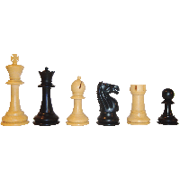
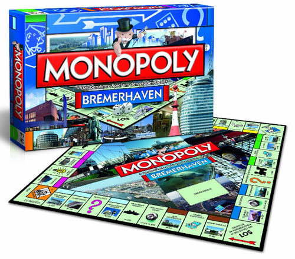
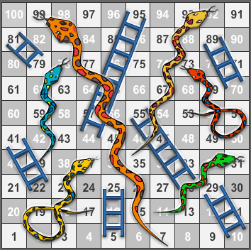

<u>Irfan Bashir</u>

**<u>In Class Assignment 5</u>**

<h1> Board Games </h1>

A board game is a tabletop game that involves counters or pieces moved or placed on a pre-marked surface or "board", according to a set of rules. Some games are based on pure strategy, but many contain an element of chance; and some are purely chance, with no element of skill.

Games usually have a goal that a player aims to achieve. Early board games represented a battle between two armies, and most modern board games are still based on defeating opponents in terms of counters, winning position, or accrual of points.

here are many varieties of board games. Their representation of real-life situations can range from having no inherent theme, like checkers, to having a specific theme and narrative, like Cluedo. Rules can range from the very simple, like Tic-tac-toe, to those describing a game universe in great detail, like Dungeons & Dragons – although most of the latter are role-playing games where the board is secondary to the game, serving to help visualize the game scenario.

The time required to learn to play or master a game varies greatly from game to game, but is not necessarily correlated with the number or complexity of rules; games like [chess](https://en.wikipedia.org/wiki/Chess) or [Go](https://en.wikipedia.org/wiki/Go_(board_game)) possess relatively simple [rulesets](https://en.wikipedia.org/wiki/Glossary_of_board_games#ruleset), but have great strategic depth.

**<u>Following is a list of three popular Board Games:</u>**

<h2> Board Game: Chess </h2>

**About:**

Chess is a two-player strategy board game played on a chessboard, a checkered gameboard with 64 squares arranged in an 8×8 grid.[1] The game is played by millions of people worldwide. Each player begins with 16 pieces: one king, one queen, two rooks, two knights, two bishops, and eight pawns. Each of the six piece types moves differently, with the most powerful being the queen and the least powerful the pawn. The objective is to checkmate[note 1] the opponent's king by placing it under an inescapable threat of capture. To this end, a player's pieces are used to attack and capture the opponent's pieces, while supporting each other. In addition to checkmate, the game can be won by voluntary resignation of the opponent, which typically occurs when too much material is lost or checkmate appears inevitable. There are also several ways a game can end in a draw.

**Rules:**

- The [king](https://en.wikipedia.org/wiki/King_(chess)) moves exactly one square horizontally, vertically, or diagonally. A special move with the king known as *castling* is allowed only once per player, per game (see below).
- A [rook](https://en.wikipedia.org/wiki/Rook_(chess)) moves any number of vacant squares in a horizontal or vertical direction. It also is moved when castling.
- A [bishop](https://en.wikipedia.org/wiki/Bishop_(chess)) moves any number of vacant squares in any diagonal direction.
- The [queen](https://en.wikipedia.org/wiki/Queen_(chess)) moves any number of vacant squares in a horizontal, vertical, or diagonal direction.
- A [knight](https://en.wikipedia.org/wiki/Knight_(chess)) moves to the nearest square not on the same [rank](https://en.wikipedia.org/wiki/Glossary_of_chess#rank), [file](https://en.wikipedia.org/wiki/Glossary_of_chess#file), or [diagonal](https://en.wikipedia.org/wiki/Glossary_of_chess#diagonal). (This can be thought of as moving two squares horizontally then one square vertically, or moving one square horizontally then two squares vertically—i.e. in an "L" pattern.) The knight is not blocked by other pieces: it jumps to the new location.
- [Pawns](https://en.wikipedia.org/wiki/Pawn_(chess)) have the most complex rules of movement

**Strategy:**

Chess strategy consists of setting and achieving long-term positioning advantages during the game – for example, where to place different pieces – while tactics concentrate on immediate maneuver. These two parts of the chess-playing process cannot be completely separated, because strategic goals are mostly achieved through tactics, while the tactical opportunities are based on the previous strategy of play. A game of chess is normally divided into three phases: opening, typically the first 10 moves, when players move their pieces to useful positions for the coming battle; then middlegame; and last the endgame, when most of the pieces are gone, kings typically take a more active part in the struggle, and pawn promotion is often decisive.

*Photo:*

<h2> Board Game: Monopoly </h2>

**About:**

Monopoly is a board game where players roll two six-sided dice to move around the game-board buying and trading properties, and develop them with houses and hotels. Players collect rent from their opponents, with the goal being to drive them into bankruptcy. Money can also be gained or lost through Chance and Community Chest cards, and tax squares; players can end up in jail, which they cannot move from until they have met one of several conditions. The game has numerous house rules and hundreds of different editions exist, in addition to many spin-offs and related media; Monopoly has become a part of international popular culture, having been locally licensed in more than 103 countries and printed in more than thirty-seven languages.

**Rules:**

Players take turns in order, with the initial player determined by chance before the game. A typical turn begins with the rolling of the dice and advancing a piece clockwise around the board the corresponding number of squares. If a player rolls doubles, he rolls again after completing his turn. A player who rolls three consecutive sets of doubles on one turn has been "caught speeding" and is immediately sent to jail instead of moving the amount shown on the dice for the third roll. A player who lands on or passes the Go space collects 200 from the bank. Players who land on either Income Tax or Luxury Tax pay the indicated amount to the bank. In older editions of the game, two options were given for Income Tax: either pay a flat fee of 200 or 10% of total net worth (including the current values of all the properties and buildings owned), but no calculation could be made before the choice, and no latitude was given for reversing an unwise calculation. In 2008, the calculation option was removed from the official rules, and simultaneously Luxury Tax was increased to $100 from its original $75. No reward or penalty is given for landing on Free Parking. Properties can only be developed once a player owns all the properties in that color group, and then must be developed equally. A house must be built on each property of that color before a second can be built. Each property within a group must be within one house level of all of the others within that group.

A player is sent to jail for doing any of the following:

- Landing directly on "Go to Jail"

- Throwing three consecutive doubles in one turn

- Drawing a "Go to Jail" card from Chance or Community Chest

  ​

**Strategy:**

According to Jim Slater in The Mayfair Set, the Orange property group is the best to own because players land on them more often, as a result of the Chance cards Go to Jail, Advance to St. Charles Place (Pall Mall), Advance to Reading Railroad (Kings Cross Station) and Go Back Three Spaces.[61] In all, during game play, Illinois Avenue (Trafalgar Square), New York Avenue (Vine Street), B&O Railroad (Fenchurch Street Station), and Reading Railroad (Kings Cross Station) are the most frequently landed-upon properties. Mediterranean Avenue (Old Kent Road), Baltic Avenue (Whitechapel Road), Park Place (Park Lane), and Oriental Avenue (The Angel Islington) are the least-landed-upon properties. Among the property groups, the Railroads are most frequently landed upon, as no other group has four properties; Orange has the next highest frequency, followed by Red. End game[edit] One common criticism of Monopoly is that although it has carefully defined termination conditions, it may take an unlimited amount of time to reach them. Edward P. Parker, a former president of Parker Brothers, is quoted as saying, "We always felt that forty-five minutes was about the right length for a game, but Monopoly could go on for hours. Also, a game was supposed to have a definite end somewhere. In Monopoly you kept going around and around." Hasbro states that the longest game of Monopoly ever played lasted 1,680 hours (70 days or 10 weeks or 2.3 months).

*Photo:*

<h2> Board Game: Snakes And Ladders </h2>

**About:**

Snakes and Ladders is an ancient Indian board game regarded today as a worldwide classic.[1] It is played between two or more players on a gameboard having numbered, gridded squares. A number of "ladders" and "snakes" are pictured on the board, each connecting two specific board squares. The object of the game is to navigate one's game piece, according to die rolls, from the start (bottom square) to the finish (top square), helped or hindered by ladders and snakes respectively. The game is a simple race contest based on sheer luck, and is popular with young children.[2] The historic version had root in morality lessons, where a player's progression up the board represented a life journey complicated by virtues (ladders) and vices (snakes). A commercial version with different morality lessons, Chutes and Ladders, is published by Milton Bradley.

**Rules:**

Each player starts with a token on the starting square (usually the "1" grid square in the bottom left corner, or simply, off the board next to the "1" grid square) and takes turns to roll a single die to move the token by the number of squares indicated by the die roll. Tokens follow a fixed route marked on the gameboard which usually follows a boustrophedon (ox-plow) track from the bottom to the top of the playing area, passing once through every square. If, on completion of a move, a player's token lands on the lower-numbered end of a "ladder", the player moves the token up to the ladder's higher-numbered square. If the player lands on the higher-numbered square of a "snake" (or chute), the token must be moved down to the snake's lower-numbered square. If a player rolls a 6, the player may, after moving, immediately take another turn; otherwise play passes to the next player in turn. The player who is first to bring their token to the last square of the track is the winner.

**Strategy:**

Any version of Snakes and Ladders can be represented exactly as an absorbing Markov chain, since from any square the odds of moving to any other square are fixed and independent of any previous game history.(https://en.wikipedia.org/wiki/Snakes_and_Ladders#cite_note-Mathematical_Gazette-4) The Milton Bradley version of Chutes and Ladders has 100 squares, with 19 chutes and ladders. A player will need an average of 39.6 spins to move from the starting point, which is off the board, to square 100. A two-player game is expected to end in 47.76 moves with a 50.9% chance of winning for the first player.(https://en.wikipedia.org/wiki/Snakes_and_Ladders#cite_note-17) In the book Winning Ways the authors show how to treat Snakes and Ladders as an impartial game in combinatorial game theory even though it is very far from a natural fit to this category. To this end they make a few rule changes such as allowing players to move any counter any number of spaces, and declaring the winner as the player who gets the last counter home. Unlike the original game, this version, which they call Adders-and-Ladders, involves skill.

*Photo:*

